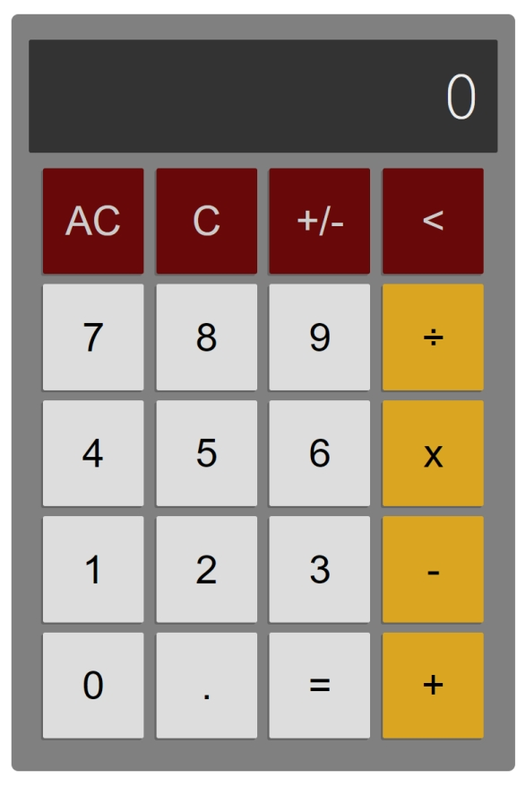

# Calculator

Calculator is a project from the Web Development 101 course of The Odin Project.

It features button-click audio, accepts keyboard input, and has Backspace, Sign toggle, Clear, and All Clear buttons, in addition to the standard number, Equals, and decimal buttons.

